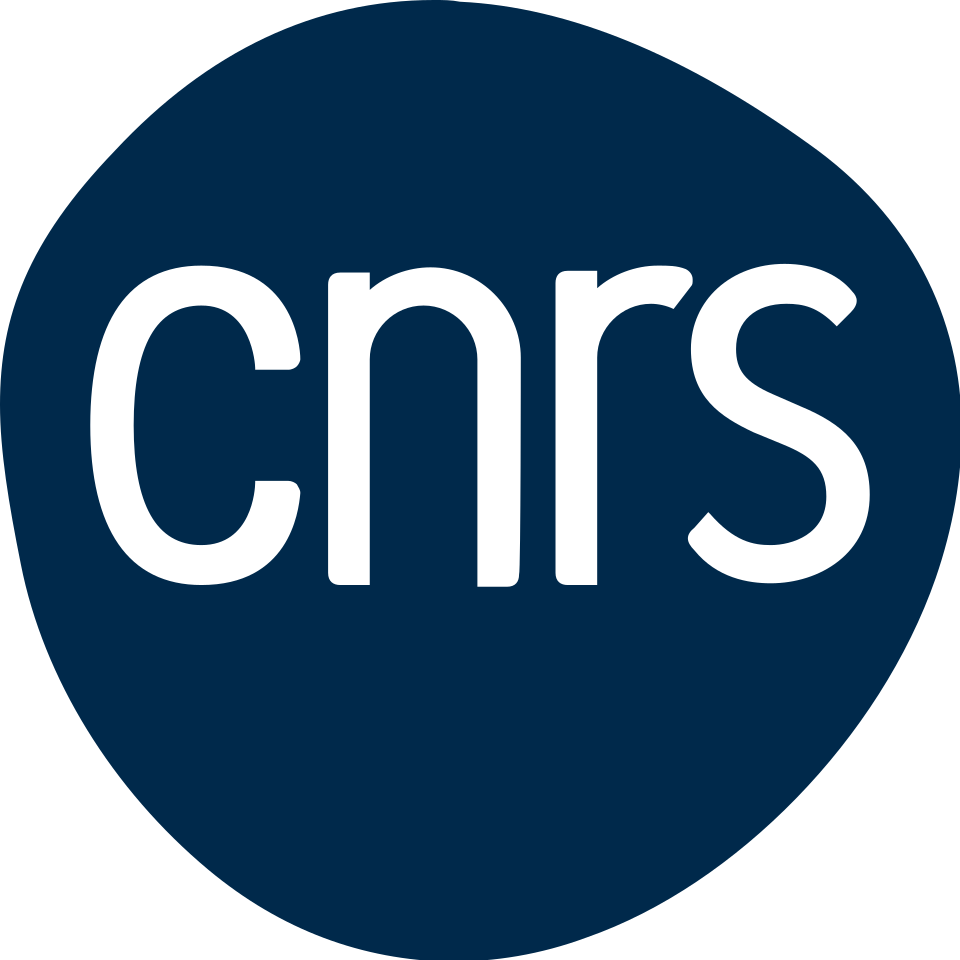

I thank the [CNRS - MITI](https://miti.cnrs.fr/#pll_switcher) for funding our DOLMEN project "Design Optimal de Ligaments pour des Machines Electriques Novatrices" (Optimal Design of Ligament for Novel Electrical Machines). Together with [Charles Dapogny](https://dapogny.org/), we'll explore the possibilities offered by a new mathematical tool developed by Charles, the calculuus of variations induced by [topological ligaments](https://www.numdam.org/item/SMAI-JCM_2021__7__185_0/) in the optimal design of electrical machines.

