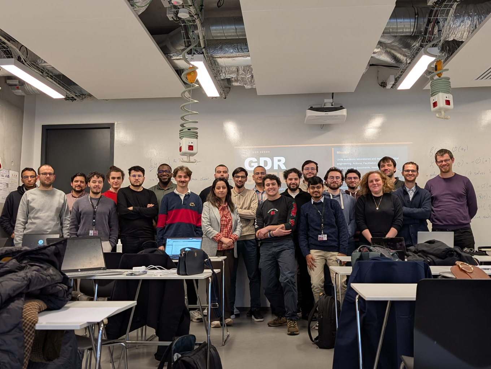

Together with my colleagues [Maya Hage-Hassan](https://cv.hal.science/hagehassan-m) (Associate Professor, CentraleSupélec), [Thomas Gauthey](https://www.centralesupelec.fr/chercheurs/thomas-gauthey) (PhD student, CentraleSupélec/X/Safran) and [Nepomuk Krenn](https://www.oeaw.ac.at/ricam/staff/nepomuk-krenn) (PhD Student, RICAM), we had the pleasure to organize a two-day workshop on topology optimization. The program is available [here](Planning_Workshop_TO.pdf).
During the first day (12/03/2026), we had very interesting presentations on topology optimization from academia and industry by:

- Prof. [Grégoire Allaire](http://www.cmap.polytechnique.fr/~allaire/) (\'Ecole polytechnique, CMAP) : "Topology optimization of structures: old and new"
- Dr. Olivier Brun (Siemens Digital Industries Software) : "Topology Optimization of electrical machines @ Siemens"
- Paolo Casco (COMSOL) : "Topology Optimization with COMSOL Multiphysics®"
- Nepomuk Krenn (RICAM) : "Multiphysical Topology Optimization of an Electric Machine using Topological Derivatives"

The second day (13/03) was dedicated to a tutorial on topology optimization for PhD students. The material is available [here](https://tcherrie.github.io/tutorial-topopt/lab/?path=student/0_index.ipynb), and will be updated and improved for the next sessions! Below a group picture of the attendees of the tutorial.

